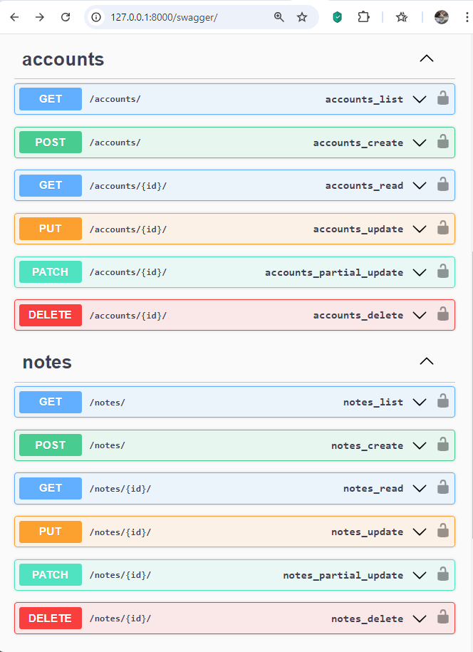

# NoteManager

## Установка

1. Клонируйте репозиторий
2. Установите зависимости: `pip install -r requirements.txt`
3. Примените миграции: `python manage.py migrate`
4. Запустите сервер: `python manage.py runserver`

## Использование

- Администраторы могут управлять пользователями: создавать, изменять 
и удалять через API.
- Все авторизированные пользователи могут управлять только своими заметками.

## Маршруты

- `GET    /api/accounts/` - Список пользователей (только для администраторов)
- `POST   /api/accounts/` - Создание пользователя (только для администраторов)
- `PUT    /api/accounts/id/` - Изменение данных пользователя (только для администраторов)
- `DELETE /api/accounts/id/` - Удаление пользователя (только для администраторов)

- `GET    /api/notes/` - Список заметок текущего пользователя
- `POST   /api/notes/` - Создание новой заметки текущего пользователя
- `PUT    /api/notes/id/` - Изменение заметки текущего пользователя
- `DELETE /api/notes/id/` - Удаление заметки текущего пользователя

Доступ ко всем заметкам можно получить в браузере по адресу: http://127.0.0.1:8000/notes/

## Документация

1. [ ] Swagger http://127.0.0.1:8000/swagger/
2. [ ] Redoc http://127.0.0.1:8000/redoc/

